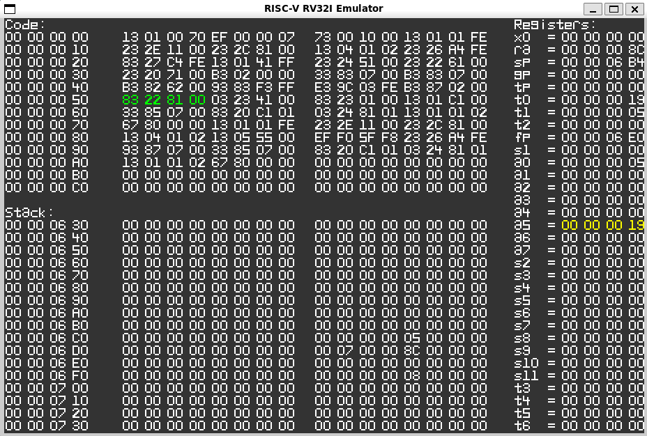

# RV32I-Assembler-Emulator
This project implements a basic Parser, Assembler and Emulator for the RISC-V RV32I
instruction set. It is created for learning purposes and is thus not guaranteed
to work correctly for every used file. (Still in testing)

## Building the project:

Building the project requires cmake 3.16 or later and SDL2.

cd repo \
mkdir build \
cd build \
cmake .. \
make \
./rv32i_assemble_emulate [file_name]

The given file has to contain RV32I instructions with correct syntax otherwise the
program will not assemble it. Labels are defined by a name with a ':' at
the end. The assembly program should start with a *_start* label that contains an EBREAK instruction at its end.
Otherwise the program will only stop after reading an unknown instruction from memory.

The emulator shows a section of memory around the program count, around the stack pointer
and also shows the current register state. The current instruction is marked as green
and changed bytes are marked as yellow. Pressing 'x' will execute the instruction and
make the changes visible.

## Example

There are several example assembly files in *FileTests* that can be run. Below is shown an example of the execution of file
*square.rasm*, which corresponds to the following source code and was partly generated by the *RISC-V rv32gcc clang* compiler from
[godbolt.org](https://godbolt.org/). Unfortunately, godbolt is not able to generate purely RV32I instructions, even when using the compiler
flag *-march=rv32i*, since it includes some calls to libgcc which was not built with *-march=rv32i*. As such, I provide a python script
(scripts/main.py) that takes as input assembly instructions produced by godbolt using *-march=rv32gc* and converts all (most at least)
instructions that do not exist in RV32I to its RV32I equivalent (with some overhead, e.g. replacing the MUL instruction with a loop).

Source code:
```
int square(int num) {
    return num * num;
}

int main() {
    int s = square(5);
}
```

Example showing the graphical instruction stepper. Result of the square function is in register *a5*.


## Supported Instructions:

The RV32I instruction set includes the following instructions and instruction types:

**U(pper Immediate) Types:** \
*AUIPC, LUI* \
Usage: INSTRUCTION rd, imm

**J(ump) Types:** \
*JAL* \
Usage: INSTRUCTION rd, label

**R Types:** \
*ADD, AND, OR, SLL, SLT, SLTU, SRA, SRL, SUB, XOR* \
Usage: INSTRUCTION rd, rs1, rs2

**I(mmediate) Types:** \
*ADDI, ANDI, ORI, SLTI, SLTIU, XORI* \
Usage: INSTRUCTION rd, rs1, imm

*JALR, LB, LBU, LH, LHU, LW* \
Usage: INSTRUCTION rd, imm(rs1)

*SLLI, SRAI, SRLI* \
Usage: INSTRUCTION rd, rs1, shamt \
(shamt = shift amount, only 5 bits)

**S(tore) Types:** \
*SB, SH, SW* \
Usage: INSTRUCTION rs2, imm(rs1)

**B(ranch) Types:** \
*BEQ, BGE, BGEU, BLT, BLTU, BNE* \
Usage: INSTRUCTION rs1, rs2, label

## Available Registers:

The 32 registers can be accessed by using their synonyms. The zero register always
stores the value 0 and thus writes to this register will not change the value of this
register.

| Register | Synonym |
|--------- |---------|
| x0       | zero    |
| x1       | ra      |
| x2       | sp      |
| x3       | gp      |
| x4       | tp      |
| x5       | t0      |
| x6       | t1      |
| x7       | t2      |
| x8       | fp/s0   |
| x9       | s1      |
| x10      | a0      |
| x11      | a1      |
| x12      | a2      |
| x13      | a3      |
| x14      | a4      |
| x15      | a5      |
| x16      | a6      |
| x17      | a7      |
| x18      | s2      |
| x19      | s3      |
| x20      | s4      |
| x21      | s5      |
| x22      | s6      |
| x23      | s7      |
| x24      | s8      |
| x25      | s9      |
| x26      | s10     |
| x27      | s11     |
| x28      | t3      |
| x29      | t4      |
| x30      | t5      |
| x31      | t6      |

